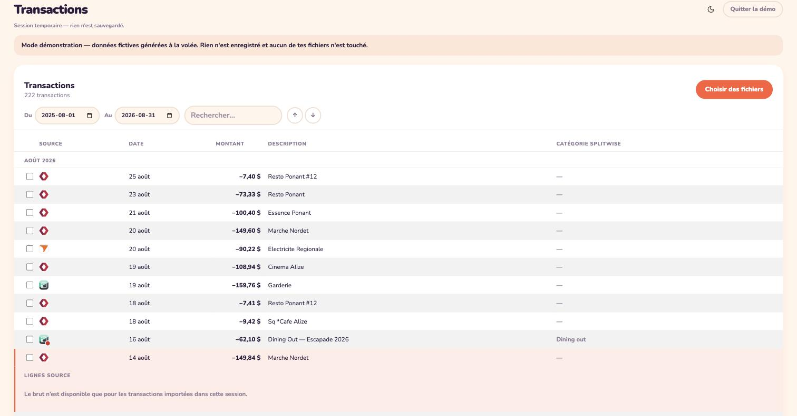
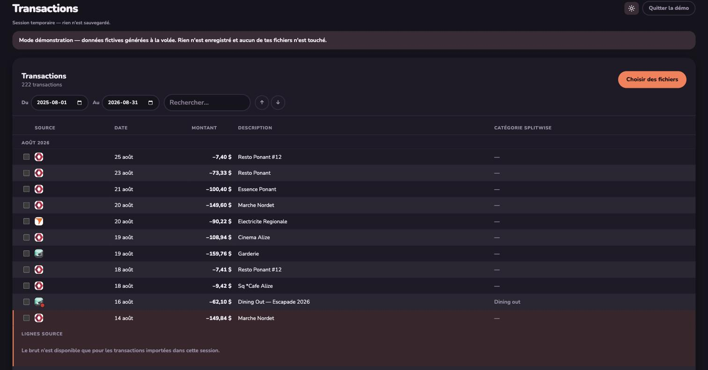

# Simple Budgeto

A tiny, no-build web app for reconciling personal transactions from your bank and
credit-card CSV exports. It reads the files locally, removes duplicates across
statements, matches Splitwise expenses to the bank line that paid them, and lets
you review everything in one table.

**Your data never leaves your machine.** There is no server and no account — the
app writes to a folder you pick (via the browser's File System Access API) and
nothing is uploaded anywhere.

🔗 **Live app:** https://ericmatte.me/simple-budgeto/
🔍 **Try the demo (fake data, nothing saved):** https://ericmatte.me/simple-budgeto/?demo

## Screenshots

| Light | Dark |
| --- | --- |
|  |  |

## Features

- **CSV import** for CIBC, Tangerine, Wealthsimple, Splitwise, plus a generic
  fallback parser.
- **Deduplication** across statements so re-importing an overlapping export does
  not create doubles.
- **Splitwise reconciliation** — pairs a Splitwise expense with the bank
  transaction that settled it, even when they fall a few days apart.
- **Filtering** by date range and free-text search, grouped by month.
- **Light / dark theme**, remembered between visits.
- Excel-ready copy: each row can be copied as a `+amount+N("note")` formula.

## Data & privacy

- The app stores your budget in a local folder you choose. Point it at a folder
  inside your Drive/Dropbox sync folder if you want it backed up.
- You can keep several budgets (one per person or project) and switch between
  them.
- Demo mode (`?demo`) generates a year of fake data in memory only — no folder is
  touched and nothing is written to disk.

## Run locally

Requires Node 22+.

```bash
npm install   # only needed to regenerate the vendored emoji-mart files
npm start     # serves the app at http://localhost:5173
```

A static server is needed because the File System Access API requires a secure
context (`http://localhost` counts, `file://` does not). `serve.js` is a
dependency-free static server for exactly this.

## Tests

```bash
npm test
```

Uses the built-in `node:test` runner. The suite also runs in **GitHub Actions on
every push and pull request** (see `.github/workflows/ci.yml`).

## Deployment

The app is plain static files with no build step, served from the repository root
by GitHub Pages (`main` branch, `/` folder). The site uses the account-level
custom domain `ericmatte.me`; `ericmatte.github.io/simple-budgeto/` redirects to
it.

Everything resolves through relative paths, so it also works unchanged from any
sub-path or other static host (Cloudflare Pages, Netlify, …). The one runtime
dependency, [emoji-mart](https://github.com/missive/emoji-mart), is vendored into
`vendor/emoji-mart/` so no `node_modules` is required at runtime.

## Browser support

Picking a budget folder relies on `showDirectoryPicker`, which today ships only in
Chromium-based browsers (Chrome, Edge, Brave, Arc). Demo mode works everywhere.

## Tech

Vanilla JavaScript ES modules, no framework, no bundler. `emoji-mart` is the only
third-party runtime code.
